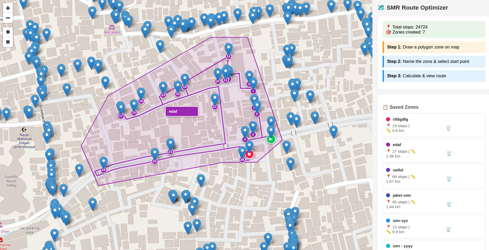

# Route Optimizer

A single-page web application for optimizing delivery routes by drawing zones on an interactive map.

## Features

- 🗺️ **Interactive Map** - OpenStreetMap with marker clustering
- ✏️ **Draw Zones** - Draw polygon or rectangle zones on the map
- 📝 **Name Zones** - Assign custom names to each zone
- 🎯 **Select Start Point** - Choose where the delivery route begins
- 🚗 **Route Optimization** - Calculates optimal delivery path using TSP algorithms
- 🎨 **Visual Routes** - Each zone has unique color with numbered markers
- 🟢 **Start/End Markers** - Green start point, red end point
- 💾 **Auto Save** - All zones saved to JSON file
- 📱 **Network Access** - Access from any device on local network

## Requirements

- Python 3.x
- No external packages required (uses standard library only)

## Folder Structure

```
route-optimizer/
├── route-optimizer.py      # Main application script
├── data.json               # Your stop/shop data (required)
├── zones_routes.json       # Saved zones & routes (auto-generated)
├── README.md               # Documentation
└── .gitignore              # Git ignore rules
```

## Files

| File | Description |
|------|-------------|
| `route-optimizer.py` | Main application script |
| `data.json` | Stop/shop data (required) |
| `zones_routes.json` | Saved zones and routes (auto-generated) |

## Configuration

Edit these variables in `route-optimizer.py` (lines 20-24):

```python
DATA_FILE = 'data.json'           # Input data file
WORKING_DIR = '/path/to/folder'   # Working directory
OUTPUT_FILE = 'zones_routes.json' # Output file
PORT = 9541                       # Server port
```

## Usage

### Start the Server

```bash
cd "/home/sajadulakash/Desktop/SMR PO"
python smr-po.py
```

### Access URLs

| Device | URL |
|--------|-----|
| Local | http://localhost:9541 |
| Network | http://YOUR_IP:9541 |

### Create a Zone

1. **Draw** - Use polygon/rectangle tool to draw a zone on the map
2. **Name** - Enter a name for the zone in the sidebar
3. **Start Point** - Select the starting shop from dropdown
4. **Calculate** - Click "Calculate Optimized Route"
5. **Repeat** - Add more zones as needed

## Input Data Format

The input JSON file should contain an array of shops with:

```json
[
  {
    "id": "123",
    "name": "Shop Name",
    "address": "Shop Address",
    "area": "Area Name",
    "lat": "23.8692469° N",
    "long": "90.3686844° E"
  }
]
```

## Output Data Format

The `zones_routes.json` file contains:

```json
{
  "zones": [
    {
      "name": "Zone Name",
      "polygon": [[lat, lon], ...],
      "total_stops": 50,
      "total_distance_km": 12.5,
      "route": [
        {"id": "1", "name": "Shop 1", "lat": 23.86, "lon": 90.36},
        ...
      ]
    }
  ]
}
```

## Algorithms

### Nearest Neighbor
Initial route construction - starts from selected point, always visits the nearest unvisited stop.

### 2-Opt Improvement
Route optimization - reverses segments to reduce total distance. Limited to 30 iterations for performance.

### Haversine Distance
Calculates straight-line distance between GPS coordinates in kilometers.

## Route Visualization

| Marker | Color | Symbol | Description |
|--------|-------|--------|-------------|
| Start | 🟢 Green | ▶ | First stop in route |
| Middle | Zone color | 1,2,3... | Numbered stops |
| End | 🔴 Red | ◼ | Last stop in route |

## API Endpoints

| Method | Endpoint | Description |
|--------|----------|-------------|
| GET | `/` | Main application page |
| GET | `/api/zones` | Get all saved zones |
| POST | `/api/optimize` | Calculate optimized route |
| POST | `/api/clear` | Clear all zones |

## License

Internal use only.

## Screenshot


