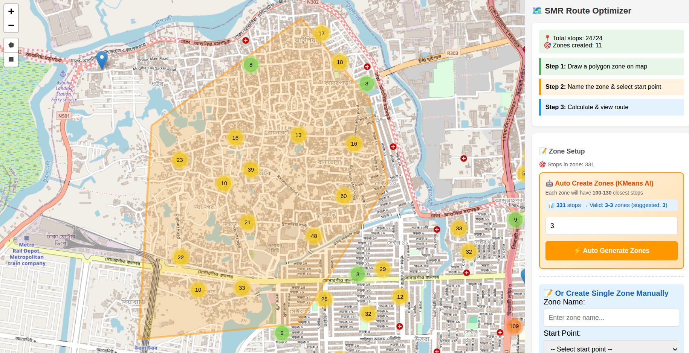

# SMR Route Optimizer

A powerful single-page web application for optimizing delivery routes with AI-powered automatic zone creation using KMeans clustering.

## Features

### Core Features
- 🗺️ **Interactive Map** - OpenStreetMap with marker clustering (24,000+ stops supported)
- ✏️ **Draw Zones** - Draw polygon or rectangle zones on the map
- 📝 **Name Zones** - Assign custom names to each zone
- ✏️ **Rename Zones** - Edit zone names anytime (click pencil icon)
- 🎯 **Select Start Point** - Choose where the delivery route begins
- 🚗 **Route Optimization** - Calculates optimal delivery path using Google OR-Tools TSP solver
- 🛣️ **Real Road Routing** - Uses OSRM API for actual road distances (not straight-line)
- 🎨 **Visual Routes** - Each zone has unique color with numbered markers
- 🟢 **Start/End Markers** - Green start point, red end point
- 💾 **Auto Save** - All zones saved to JSON file
- 📱 **Network Access** - Access from any device on local network
- 🗑️ **Delete Zones** - Remove individual zones or clear all

### AI Auto-Zone Creation (KMeans)
- 🤖 **KMeans Clustering** - Automatically split large areas into optimal zones
- 📊 **Smart Zone Sizing** - Each zone guaranteed 100-130 stops
- 🎯 **Geographic Clustering** - Ensures closest stops are grouped together
- ⚖️ **Auto-Rebalancing** - Moves points between clusters to meet size constraints
- 📏 **Valid Range Calculator** - Shows min/max zones based on total stops
- 🏷️ **Auto-Naming** - Zones named "Zone 1", "Zone 2", etc.

## Requirements

```bash
# Python packages
pip install numpy scikit-learn ortools
```

- Python 3.8+
- numpy
- scikit-learn (for KMeans clustering)
- ortools (Google OR-Tools for TSP optimization)

## Folder Structure

```
SMR PO/
├── smr-po.py                              # Main application script
├── product_sense_public_shops_with_area.json  # Stop/shop data (required)
├── zones_routes.json                      # Saved zones & routes (auto-generated)
├── README.md                              # Documentation
├── Assets/                                # Screenshots and assets
└── cache/                                 # OSRM route cache
```

## Configuration

Edit these variables in `smr-po.py` (lines 22-26):

```python
DATA_FILE = 'product_sense_public_shops_with_area.json'  # Input data file
WORKING_DIR = '/home/sajadulakash/Desktop/SMR PO'        # Working directory
OUTPUT_FILE = 'zones_routes.json'                        # Output file
PORT = 9541                                              # Server port
```

### Zone Size Constraints (lines 521-522):

```python
MIN_ZONE_SIZE = 100  # Minimum stops per zone
MAX_ZONE_SIZE = 130  # Maximum stops per zone
```

## Usage

### Start the Server

```bash
cd "/home/sajadulakash/Desktop/SMR PO"
conda activate smrpo
python smr-po.py
```

### Access URLs

| Device | URL |
|--------|-----|
| Local | http://localhost:9541 |
| Network | http://YOUR_IP:9541 |

### Create a Single Zone (Manual)

1. **Draw** - Use polygon/rectangle tool to draw a zone on the map
2. **Name** - Enter a name for the zone in the sidebar
3. **Start Point** - Select the starting shop from dropdown
4. **Calculate** - Click "Calculate Optimized Route"
5. **Repeat** - Add more zones as needed

### Create Multiple Zones (AI Auto-Zone)

1. **Draw Large Area** - Draw a polygon covering 700-1000+ stops
2. **View Range** - System shows valid zone range (e.g., "5-8 zones")
3. **Enter Count** - Type number of zones you want
4. **Generate** - Click "⚡ Auto Generate Zones"
5. **Wait** - AI clusters stops and optimizes all routes automatically

### Manage Zones

- **Rename** - Click ✏️ pencil icon → type new name → press Enter
- **Delete** - Click 🗑️ trash icon on individual zone
- **Clear All** - Click "Clear All Zones" button
- **Focus** - Click zone name to pan/zoom to that zone on map

## Input Data Format

The input JSON file should contain an array of shops:

```json
[
  {
    "id": "123",
    "name": "Shop Name",
    "address": "Shop Address",
    "area": "Area Name",
    "lat": "23.8692469° N",
    "long": "90.3686844° E"
  }
]
```

## Output Data Format

The `zones_routes.json` file contains:

```json
{
  "zones": [
    {
      "name": "Zone Name",
      "polygon": [[lat, lon], ...],
      "total_stops": 115,
      "total_distance_km": 12.5,
      "route": [
        {"id": "1", "name": "Shop 1", "lat": 23.86, "lon": 90.36},
        ...
      ],
      "road_geometry": [[lat, lon], ...]
    }
  ]
}
```

## Algorithms

### Google OR-Tools TSP Solver
- Uses Guided Local Search metaheuristic
- Same algorithm used by Google Maps
- 5-second optimization limit per zone
- Finds near-optimal solutions for routes

### OSRM Road Routing
- Real road distance matrix (not straight-line)
- Automatic point snapping to nearest road
- Considers one-way streets and road networks
- Route geometry for accurate map visualization

### KMeans Clustering (Auto-Zone)
- Groups geographically close stops together
- Iterative rebalancing to meet size constraints
- Convex hull polygon generation for zone boundaries

### Haversine Distance
- Fallback when OSRM is unavailable
- Calculates straight-line distance between GPS coordinates

## Route Visualization

| Marker | Color | Symbol | Description |
|--------|-------|--------|-------------|
| Start | 🟢 Green | ▶ | First stop in route |
| Middle | Zone color | 1,2,3... | Numbered stops |
| End | 🔴 Red | ◼ | Last stop in route |

## API Endpoints

| Method | Endpoint | Description |
|--------|----------|-------------|
| GET | `/` | Main application page |
| GET | `/api/zones` | Get all saved zones |
| POST | `/api/optimize` | Calculate optimized route for single zone |
| POST | `/api/auto-create-zones` | AI auto-create multiple zones with KMeans |
| POST | `/api/rename-zone` | Rename a zone |
| POST | `/api/delete-zone` | Delete a specific zone |
| POST | `/api/clear` | Clear all zones |

## Auto-Zone Rules

For AI auto-zone creation:

| Total Stops | Min Zones | Max Zones | Example |
|-------------|-----------|-----------|---------|
| 230 | 2 | 2 | Zone 1: 108, Zone 2: 122 |
| 500 | 4 | 5 | ~100-125 stops each |
| 1000 | 8 | 10 | ~100-125 stops each |

Formula:
- Min zones = ceil(total_stops / 130)
- Max zones = floor(total_stops / 100)

## License

Internal use only.

## Screenshots

### Main Interface - Route Optimizer


### AI Auto-Zone Creation with KMeans

