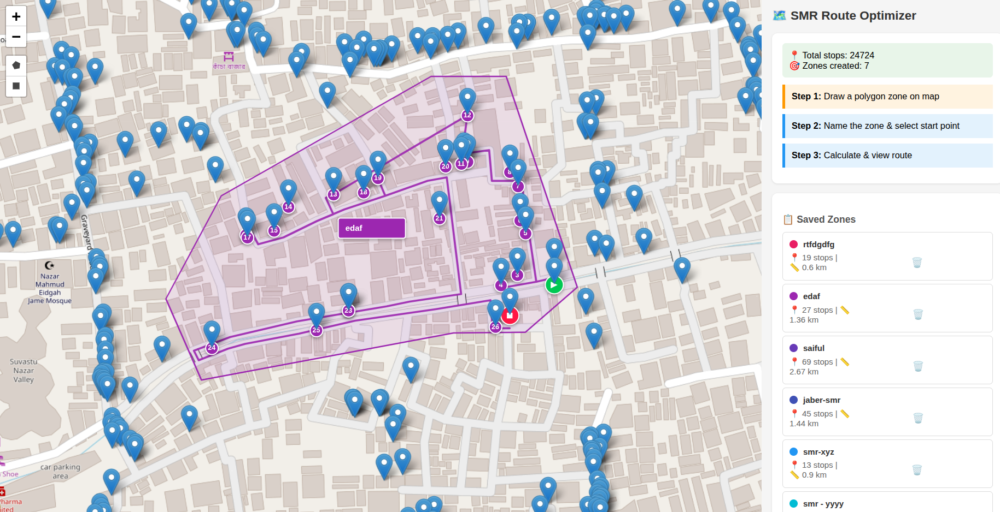
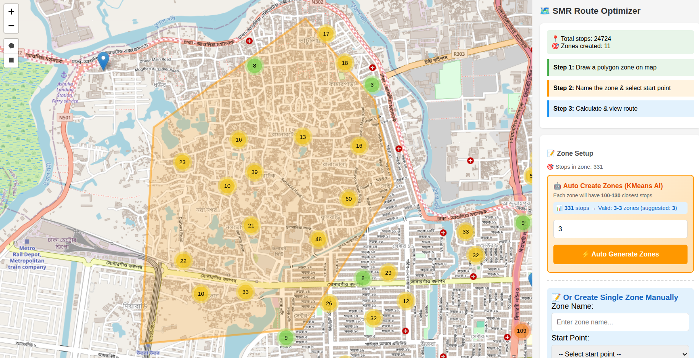

# SMR Route Optimizer

SMR Route Optimizer is a Python web application for creating sales or delivery
zones and calculating an ordered route through the shops in each zone. The
backend exposes a JSON API and serves a dedicated Google Maps frontend, while zone
data and route geometry are persisted in `zones_routes.json`.

The current dataset contains 24,724 shops in the `dhk_metro` area.

## Features

- Google Maps JavaScript frontend with native shop, zone, and route overlays
- Polygon and rectangle selection
- Manual zones with a selectable starting shop
- Automatic compact zones with a configurable target stop count
- KMeans seed selection and nearest-neighbor geographic assignment
- Google OR-Tools route ordering using Guided Local Search
- Google Maps distance and route-geometry integration
- Haversine fallback for large zones or unavailable APIs
- Numbered route markers with distinct start and end markers
- Rename, delete, focus, and clear zone actions
- Persistent zone data and cached Google Maps route segments
- Local and local-network access

## Architecture

- `backend/app.py` owns configuration, shop loading, clustering, routing,
  persistence, HTTP APIs, and static-file delivery.
- `frontend/index.html` contains the application markup.
- `frontend/styles.css` contains the page styles.
- `frontend/app.js` contains map interaction and API client behavior.
- `smr-po.py` remains a compatibility launcher and calls `backend.app.main()`.

The frontend has no build step. The backend injects shop data and the initial map
center and browser Maps API key into `frontend/index.html`, then serves the CSS and JavaScript files as
static assets.

## Routing Behavior

Routing depends on the number of shops in a zone:

- For 2-25 shops, Google Distance Matrix provides the OR-Tools cost matrix.
- For more than 25 shops, a Haversine matrix is used to limit API usage.
- After ordering, Google Directions geometry is requested one segment at a time
  in walking mode.
- Successful segment responses are cached in `cache/`.
- Failed segments fall back to a straight line and Haversine distance.

Routes are open paths. They start at the selected shop and finish at the last
optimized shop without returning to the start.

## Automatic Zone Creation

Draw a large polygon and provide either a target number of shops per zone or an
explicit number of zones. When the zone count is empty, it is calculated as:

```text
round(selected shops / target shops per zone)
```

The default target is 100 shops. The backend currently permits 1-9,999 shops per
zone, and the browser limits automatic creation to 50 zones.

The automatic-zone process:

1. Uses KMeans to select distributed seed centers.
2. Grows each zone with nearby unassigned shops.
3. Applies a 1 km nearest-shop gap check during initial assignment.
4. Assigns remaining shops to the nearest zone center.
5. Creates a convex-hull zone boundary.
6. Estimates distance and optimizes the final route.

The algorithm prioritizes compact geography and approximately balanced shop
counts. Final route distances may vary due to road access, density, and routing
fallbacks.

## Requirements

- Python 3.8+
- NumPy
- scikit-learn
- Google OR-Tools
- Google Maps API key with Directions API and Distance Matrix API access
- Internet access for frontend assets, map tiles, and uncached route requests

Install dependencies:

```bash
python -m pip install numpy scikit-learn ortools
```

The existing project environment is:

```bash
conda activate smrpo
```

Create the local environment file before the first run:

```bash
cp .env.example .env
```

Then edit `.env` and set `GOOGLE_MAPS_API_KEY`. Enable the Maps JavaScript API, Directions API, and Distance Matrix API in Google Cloud. The `.env` file is ignored by Git.

## Configuration

Runtime settings are loaded from environment variables and the ignored `.env` file:

```dotenv
GOOGLE_MAPS_API_KEY=replace-with-your-google-maps-api-key
# Recommended: use a separate HTTP-referrer-restricted browser key
# GOOGLE_MAPS_BROWSER_API_KEY=replace-with-your-browser-restricted-key
GOOGLE_MAPS_TIMEOUT=60
SMR_PORT=9541
SMR_OPEN_BROWSER=true
# SMR_WORKING_DIR=/absolute/path/to/project
# SMR_DATA_FILE=product_sense_public_shops_with_area.json
# SMR_OUTPUT_FILE=zones_routes.json
```

Exported environment variables take precedence over values in `.env`. Use separate restricted keys in production: IP-restrict the server key and HTTP-referrer-restrict the browser key. The browser key is visible to users by design. Never commit
the local `.env` file.

## Run

```bash
cd "/home/sajadulakash/Desktop/SMR PO"
conda activate smrpo
# Configure .env first if it does not already exist
python smr-po.py
```

The compatibility launcher above is recommended. The backend can also be started
directly with:

```bash
python -m backend.app
```

| Access | URL |
|---|---|
| Local | `http://localhost:9541` |
| Local network | `http://YOUR_LOCAL_IP:9541` |

The server listens on all interfaces and attempts to open the local URL in the
default browser. Stop it with `Ctrl+C`.

## Usage

### Manual Zone

1. Draw a polygon or rectangle around shops.
2. Enter a zone name.
3. Select the starting shop.
4. Click **Calculate Optimized Route**.
5. Wait for route optimization and geometry requests.

### Automatic Zones

1. Draw around a larger group of shops.
2. Set target shops per zone or enter a zone count.
3. Click **Generate Distance-Balanced Zones**.
4. Confirm the configuration.
5. Wait while each generated zone is optimized and saved.

### Saved Zones

- Click a zone name to focus it on the map.
- Use the pencil button to rename it.
- Use the trash button to delete it.
- Use **Clear All Zones** to remove all saved zones.

## Project Structure

```text
SMR PO/
|-- backend/
|   |-- __init__.py
|   `-- app.py
|-- frontend/
|   |-- index.html
|   |-- styles.css
|   `-- app.js
|-- smr-po.py
|-- .env.example
|-- product_sense_public_shops_with_area.json
|-- zones_routes.json
|-- README.md
|-- Assets/
|   |-- smr-route-optimizer.png
|   `-- ai-auto-zone-creation-KMeans.png
|-- cache/
`-- __pycache__/
```

`cache/` and `__pycache__/` are generated. The input dataset and route cache
are excluded by `.gitignore`.

## Input Format

The input is a JSON array:

```json
[
  {
    "id": "shop-id",
    "name": "Shop Name",
    "area": "dhk_metro",
    "address": "Shop Address",
    "lat": "23.8692469 N",
    "long": "90.4110807 E"
  }
]
```

Coordinates can include degree and compass suffixes. Records without usable
latitude or longitude are skipped.

## Output Format

`zones_routes.json` contains a top-level `zones` array:

```json
{
  "zones": [
    {
      "name": "Zone 1",
      "polygon": [[23.86, 90.41], [23.87, 90.42]],
      "total_stops": 100,
      "total_distance_km": 8.75,
      "route": [
        {
          "id": "shop-id",
          "name": "Shop Name",
          "address": "Shop Address",
          "lat": 23.8692469,
          "lon": 90.4110807
        }
      ],
      "road_geometry": [[23.86924, 90.41108]]
    }
  ]
}
```

Automatically created zones may also include `stops` and
`estimated_distance_km`.

## HTTP API

| Method | Endpoint | Purpose |
|---|---|---|
| `GET` | `/` | Serve the map |
| `GET` | `/api/zones` | Return saved zones |
| `POST` | `/api/optimize` | Optimize and save one zone |
| `POST` | `/api/auto-create-zones` | Generate, optimize, and save zones |
| `POST` | `/api/rename-zone` | Rename a zone by index |
| `POST` | `/api/delete-zone` | Delete a zone by index |
| `POST` | `/api/clear` | Delete all zones |

The server has no authentication. Use it only on a trusted network unless an
authenticated reverse proxy or equivalent protection is added.

## Algorithms

### OR-Tools

Uses `PATH_CHEAPEST_ARC` for the initial solution and `GUIDED_LOCAL_SEARCH`
for improvement, with a five-second limit per zone.

### Google Maps

- Distance Matrix API supplies small-zone road costs.
- Directions API supplies walking-mode route geometry.
- Encoded polylines are decoded and rendered as Google Maps polylines.
- The Maps JavaScript API renders the visible map, shops, selections, zones, and routes.
- Segment caches use SHA-1 hashes of endpoint coordinates.

### Haversine

Used for zones larger than 25 shops and as an API fallback.

### Convex Hull

Automatic boundaries use a Graham-scan-style convex hull over assigned shops.

## Screenshots

### Route Optimizer



### Automatic Zone Creation



## License

Internal use only.
